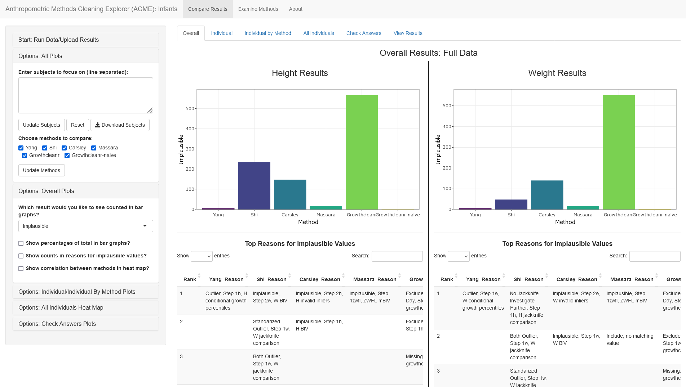
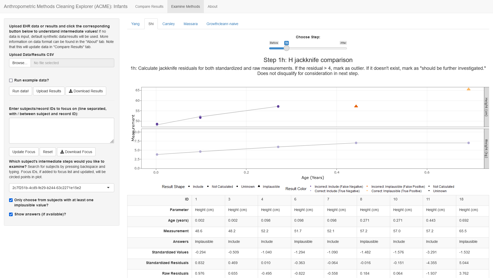

# Anthropometric Cleaning Methods Explorer (ACME)

This application seeks to provide a framework for comparing different anthropometric cleaning methods, including automatic runs for implemented algorithms, comparison visualization, and in-depth walk throughs of results.

ACME has been implemented to compare infants and adult data cleaning algorithms. For details on the algorithms implemented for each scenario and how to run them, please see below. We also provide guidance on how to adapt ACME for different algorithms.

compare different methods of cleaning adult and infants EHR data,
implementing a variety of methods. For adults, this currently includes Muthalagu, et al., Cheng, et al., Chan, et al., Littman, et al., Breland, et al., and Daymont, et al. For infants, this includes Yang, et al., Carsley, et al., Shi, et al., and Massara, et al.

## Installation and Quickstart

To run this application, please follow the following steps (assuming you have already
downloaded/cloned this repository):

1. Install [R](https://www.r-project.org/) and [RStudio](https://posit.co/products/open-source/rstudio/).
2. Open RStudio.
3. In the console window (bottom-left corner by default), enter the following to download necessary packages:

```{r}
install.packages(c("shiny", "ggplot2", "rstudioapi", "colorspace", "plotly", "viridisLite", "ggplotify", "reshape2", "shinyBS", "shinyWidgets", "data.table", "growthcleanr", "lme4", "anthro"))
```

A package from GitHub is needed as well. To download this package, enter the
following in the console:

```{r}
install.packages("devtools")
devtools::install_github("zeehio/facetscales", ref = "archived")
```

In downloading `facetscales` on Windows, it may request that you need `Rtools`. You can download that following instructions listed [here](https://cran.r-project.org/bin/windows/Rtools/)..

If you are on a Mac, R also requires the `Cairo` package, which itself requires that
the [XQuartz](https://www.xquartz.org/) package is also installed. You may need to
download and install XQuartz first, as it does not come with MacOS by default. After
XQuartz is installed on your system, install `Cairo` in R:

```{r}
install.packages("Cairo")
```

Note that this may ask for some input about updating related packages -- "no" is a fine
answer. This may take some time.

4. Open `acme_app.R`, which should be included in the downloaded files from
this repository. It should open in the top-left corner pane of RStudio by default.
5. ACME is is set to run the infants comparison algorithms by default. If you would like to use the adult comparison algorithms, comment out line 11 by putting a `#` at the beginning of the line and deleting the `#` on line 12. To run a custom configuration, please see the section "Using the ACME Framework".
5. In the top right corner of the pane with the `acme_app.R` script, you should see the
button, "Run App". Click on the small downwards arrow next to it and choose "Run
External".
6. Now click "Run App". This should open the application in your default browser window.
7. Have fun! More information on running the application and methods involved can be
found within the app.

## R and Package Versions

ACME was developed using R 4.2.1. Package versions used include:

- shiny: 1.7.1
- ggplot2: 3.3.6
- rstudioapi: 0.13
- colorspace: 2.0-3
- plotly: 4.10.0
- viridisLite: 0.4.0
- ggplotify: 0.1.0
- reshape2: 1.4.4
- shinyBS: 0.61.1
- shinyWidgets: 0.7.0
- data.table: 1.14.2
- growthcleanr: 2.0.1
- lme4: 1.1-30
- anthro: 1.0.0

If ACME is not working, please check and update package versions.

## Data Format

Data format is modeled after the [growthcleanr](https://carriedaymont.github.io/growthcleanr/articles/quickstart.html#data-preparation) algorithm. To use data within ACME, your data must contain columns with the following format (names must be exact):

- id: number for each row, must be unique
- subjid: character, subject ID
- param: character, parameter for each measurement. must be either HEIGHTCM (height in centimeters) or WEIGHTKG (weight in kilograms)
- measurement: numeric, measurement of height or weight, corresponding to the parameter
- age_years AND/OR age_days: numeric, age in years or age in days
- sex: numeric, 0 (male) or 1 (female)
- answers: (not required) character, an answer column, indicating whether the value should be Include or Implausible

## Included Algorithms

Algorithms included for comparison of infants algorithm are:
- [Yang, et al. (2016)](https://www.sciencedirect.com/science/article/pii/S1047279717306129)
- [Shi, et al. (2018)](https://www.sciencedirect.com/science/article/pii/S1047279715004184)
- [Carsley, et al. (2018)](https://informatics.bmj.com/content/25/1/19.long)
- [Massara, et al. (2021)](https://dl.acm.org/doi/abs/10.5555/3507788.3507821) (uses only BIV criteria)
- [growthcleanr](https://academic.oup.com/jamia/article/24/6/1080/3767271) (uses most recent CRAN version)
- [growthcleanr-"naive"](https://academic.oup.com/jamia/article/24/6/1080/3767271) (a modified version of growthcleanr that only uses extreme EWMA step)

Algorithms included for comparison of adult algorithms are:

- [Muthalagu, et al. (2014)](https://www.ncbi.nlm.nih.gov/pmc/articles/PMC3974252/)
- [Cheng, et al. (2016)](https://onlinelibrary.wiley.com/doi/full/10.1002/oby.21612)
- [Chan, et al. (2017)](https://www.ncbi.nlm.nih.gov/pmc/articles/PMC5359164/)
- [Littman, et al. (2012)](https://www.cdc.gov/pcd/issues/2012/11_0267.htm)
- [Breland, et al. (2017)](https://www.ncbi.nlm.nih.gov/pmc/articles/PMC5359156/)
- [growthcleanr-"naive"](https://academic.oup.com/jamia/article/24/6/1080/3767271) (a modified version of growthcleanr that only uses extreme EWMA step)

If you could like to include other algorithms in the ACME framework for comparison, see the "Using the ACME Framework for Other Anthropometric Algorithms" section.

## Features

Once you have ACME up and have run your data through, there are two parts of the application: Compare Results and Examine Methods.



Compare Results lets you view compare algorithm results at a high level, with tabs including:
- Overall: Bar graphs of counts of implausible values, reasons for those implausible values, and a correlation matrix of similarity between methods
- Individual: Scatterplots of results for a single subject, colored by whether the point was implausible by any method or not. Also includes lines of best fit and standard deviations. Counts and reasons for implausibility appear below the plot.
- Individual: Scatterplots and summaries of results for a single subject for each method.
- All Individuals: Heat map of results for all subjects across all methods, colored by correct or incorrect answers if included.
- Check Answers: Bar graphs of count of correct answers for both included and implausible values, if included.
- View Results: Table of results for each record.



Examine Methods lets you dig deeper into the reasons for each method's choices. Graphs to the right show an individual subject's value for height and weight, sorting before the algorithm. Using the slider above will let you "step through" each step in the algorithm, with:
- A short description of each step
- Updated graphs for that subject, if the step resulted in any values being designated as implausible
- A table below showing exact values for the relevant step (height, weight, or both), and values that the algorithm used to make the decision. Hovering over any point in the plot will highlight its corresponding column in the table.

## Using the ACME Framework for Other Anthropometric Algorithms

Though ACME has default configurations for sets of adult and infant algorithms, ACME can be adjusted to run and compare other sets of implemented algorithms. The process for making these changes is below, but you can also use the infants and adult sets of algorithms as working examples.

1. Name your set of algorithms with a single, non-spaced term (for example, "adult", "infants"). You will be using this term for organization throughout the ACME framework. For this set of instructions, we will call this term "group".

2. In "EHR_Cleaning_Implementations", create a folder called "group" for your algorithm implementation scripts.

3. In that folder, create scripts for your algorithm implementations. For clarity, I implemented each algorithm in its own script. Algorithms should be functions with the following signature and inputs/outputs:

```r
# inputs:
# df: data frame with 7 columns:
#   id: row id, must be unique
#   subjid: subject id
#   sex: sex of subject
#   age_days: age, in days OR age_years: age, in years, depending on your implementation
#   param: HEIGHTCM or WEIGHTKG
#   measurement: height or weight measurement
# inter_vals: boolean, return intermediate values
#
# outputs:
#   df, with additional columns:
#     result, which specifies whether the height measurement should be included,
#       or is implausible.
#     reason, which specifies, for implausible values, the reason for exclusion,
#       and the step at which exclusion occurred.
#     intermediate value columns, if specified
algorithm_function <- function(df, inter_vals = F){
  return(df)
}
```

To add intermediate steps (for the "Compare" section of ACME), add columns with intermediate values corresponding to each step in the format `Step_(NUMBER)(h or w)_(STEP TITLE)`. These intermediate step columns should only be added to output if `inter_vals = TRUE`. I would highly recommend looking at other algorithm implementations for examples.

4. In "Data", create a folder called "group" for your example datasets.

5. Add a small subset of example data in the format required (see the "Data Format" section) as a CSV. If you have an additional file that has the results included, you can include that within that folder as well.

6. Create your "config" file in the main repository folder, using "EXAMPLE_config.R" as a base. "EXAMPLE_config.R" has directions on the sections that need to be changed, designated with TODO, including:

- Comparison Title
- Data Files
- Age Range Specifications
- Algorithms Implemented
- Algorithms With Intermediate Values Implemented
- Algorithm Documentation for ACME

7. Open "acme_app.R" and change line 11 to specify your config file.

8. Then follow the instructions in "Installation and Quickstart" to get started!

# Attribution

(c) 2020-2023 The MITRE Corporation.


